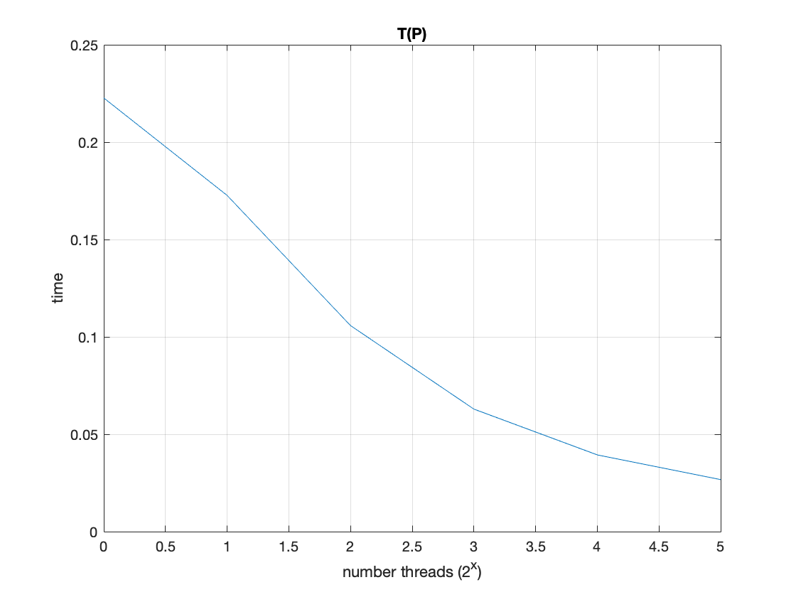
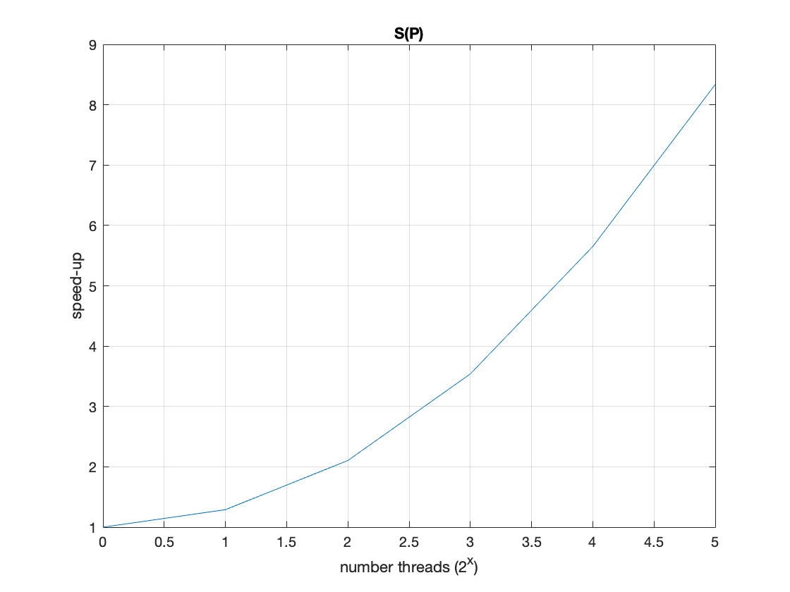
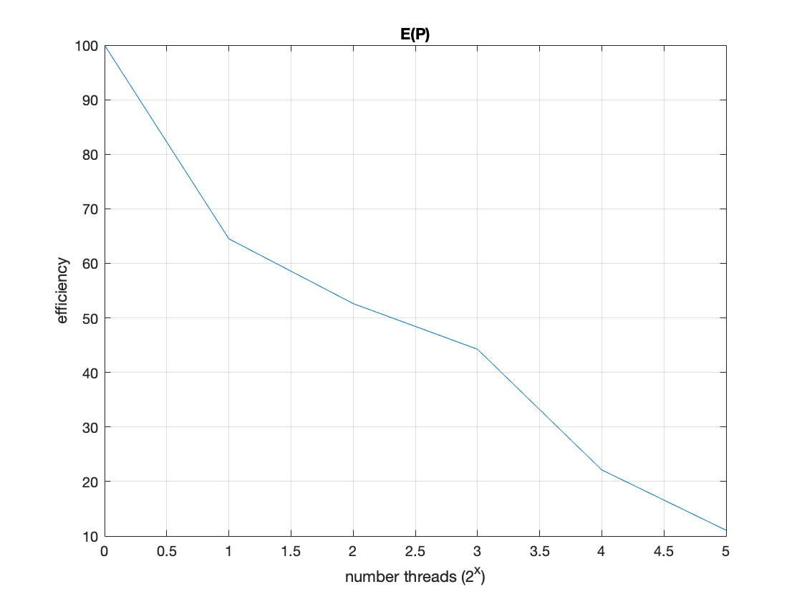
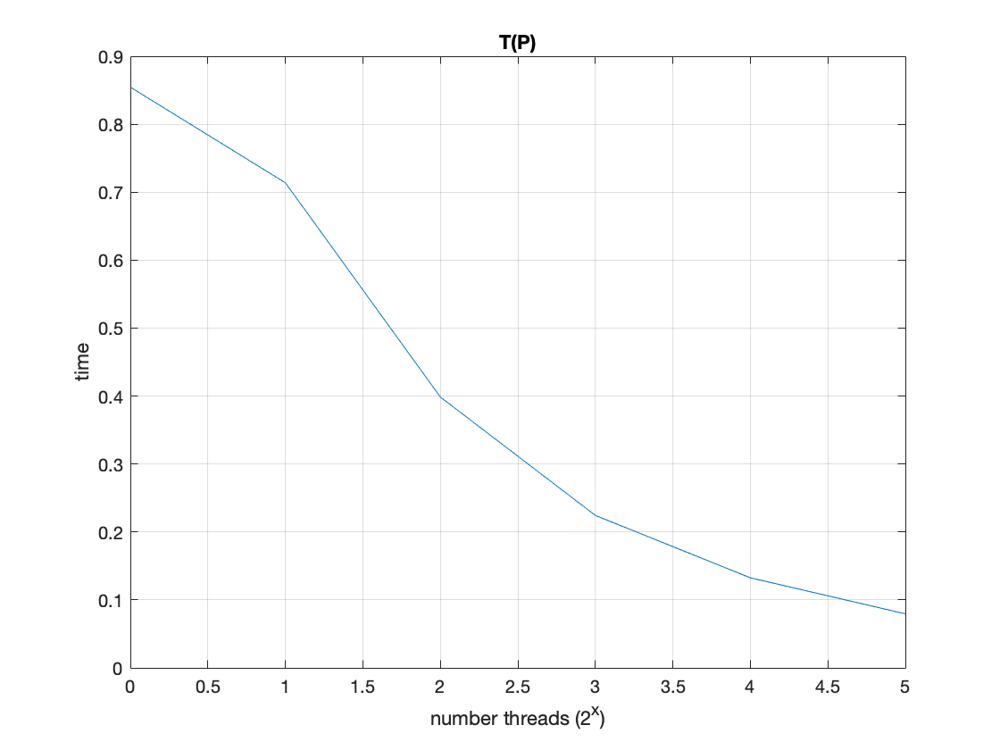
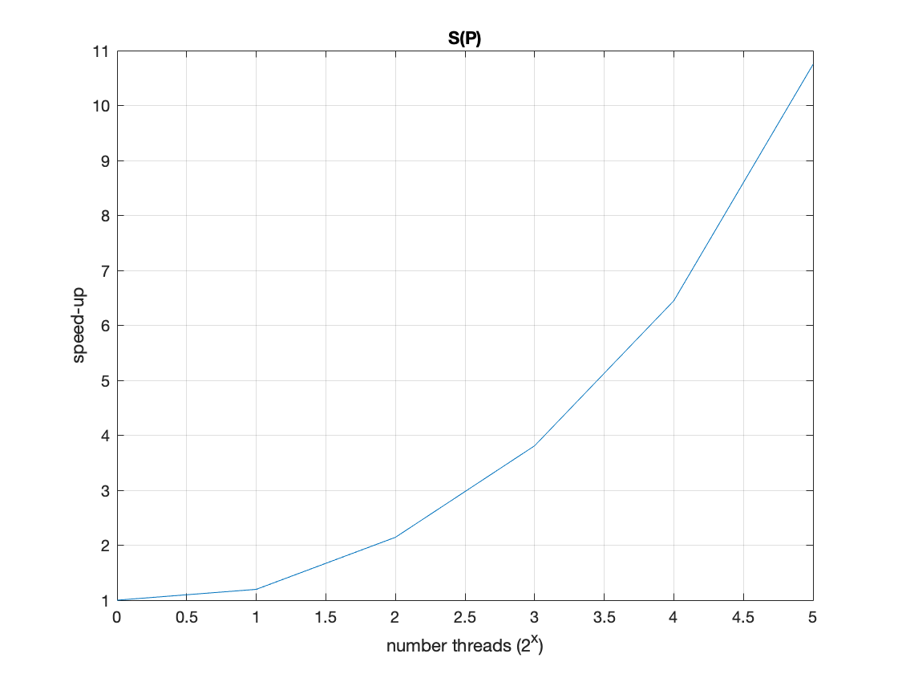
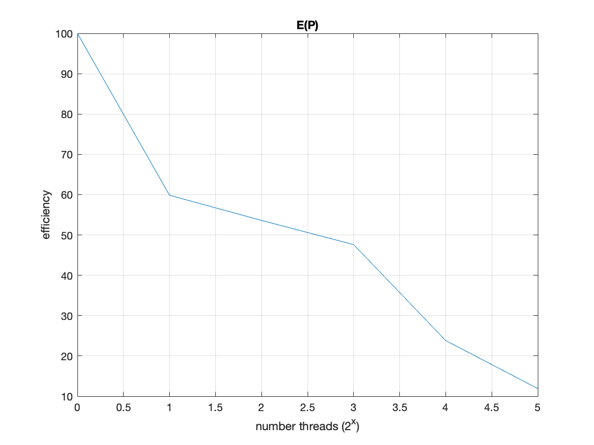

# Отчет по практическому заданию по курсу «Параллельная обработка больших графов»
Параллельная реализация алгоритма Борувки построения минимального остовного леса в графе с весами
Хабибулин Марат Ильдарович, 538, **01.06.2022**
Вариант реализации:
MPI-1, send/recv/scatter   
- Краткое описание вычислительной системы, на которой проводились запуски, версии используемого ПО    
    
Polus - параллельная вычислительная система, состоящая из 5 вычислительных узлов.  
   
(на первый вычислительный узел возложены функции frontend узла)   

Основные характеристики каждого узла:   
   
2 десятиядерных процессора IBM POWER8 (каждое ядро имеет 8 потоков) всего 160 потоков
Общая оперативная память 256 Гбайт (в узле 5 оперативная память 1024 Гбайт) с ЕСС контролем   
2 х 1 ТБ 2.5” 7K RPM SATA HDD   
2 x NVIDIA Tesla P100 GPU, 16Gb, NVLink   
1 порт 100 ГБ/сек   
Производительность кластера (Tflop/s): 55,84 (пиковая), 40,39 (Linpack)   

- Описание решения, обязательно указать, как организован параллелизм, какие средства (функции) и способ (алгоритм) используются для организации обменов между процессами
Для распределения графа по процессам используется MPI_Scatter:   
    
`       if (mp != size-1)
            MPI_Scatter(tempadj, nb_elements, MPI_DOUBLE, adj, nb_elements, MPI_DOUBLE, 0, commFirst);
        //SEND THE LAST ELEMENTS TO THE LAST PROCESS
        if (mp == 0)
            MPI_Send(tempadj+(size-1)*nb_elements, nVtx*nVtx-(size-1)*nb_elements, MPI_DOUBLE, size-1, 0, MPI_COMM_WORLD);
        else if (mp == size-1)
            MPI_Recv(adj, nVtx*nVtx-(size-1)*nb_elements, MPI_DOUBLE, 0, 0, MPI_COMM_WORLD, MPI_STATUS_IGNORE);
`

Напомним последовательный алгоритм борувки:  
1) Изначально каждая вершина графа G — тривиальное дерево, а ребра не принадлежат никакому дереву.
2) Для каждого дерева T найдем минимальное инцидентное ему ребро. Добавим все такие ребра.
3) Повторяем шаг 2 пока в графе не останется только одно дерево T. 

Параллельная реализация: 
На первом этапе высчитывается минимальный остовный лес для вершин выделенных каждому процессу(квадратики на диагонали матрицы смежности). На этом же шаге для процессов отправителей высчитывается минимальный остовный лес для вершин  находящихся левее в матрице с последующей отсылкой этих ребер процессу принимающему. Остовный лес посчитанный по выделенным процессу отправителю вершинам также пересылаются процессу принимающему с последующем перерасчетом остовного дерева из всех полученных ребер.
 Смотри рисунок:
:point_down:

Алгоритм повторяется для оставшихся процессов с удвоенным кол-вом выделенных им вершин.

- скриншоты проверки корректности решения
  

  

- Для нескольких фиксированных графов rmat и random (с указанием их параметров) – по одному графику зависимости времени решения задачи на заданном графе от количества вычислительных процессов распределенной системы.     

   
Граф c количеством вершин 2^14, степенью вершин 16: 
  

Граф c количеством вершин 2^15, степенью вершин 16: 
  

- Интерпретация результатов
В ходе практической работы все поставленные цели выполнены. Алгоритм распараллелен а результаты показывают линейную масштабируемость.
